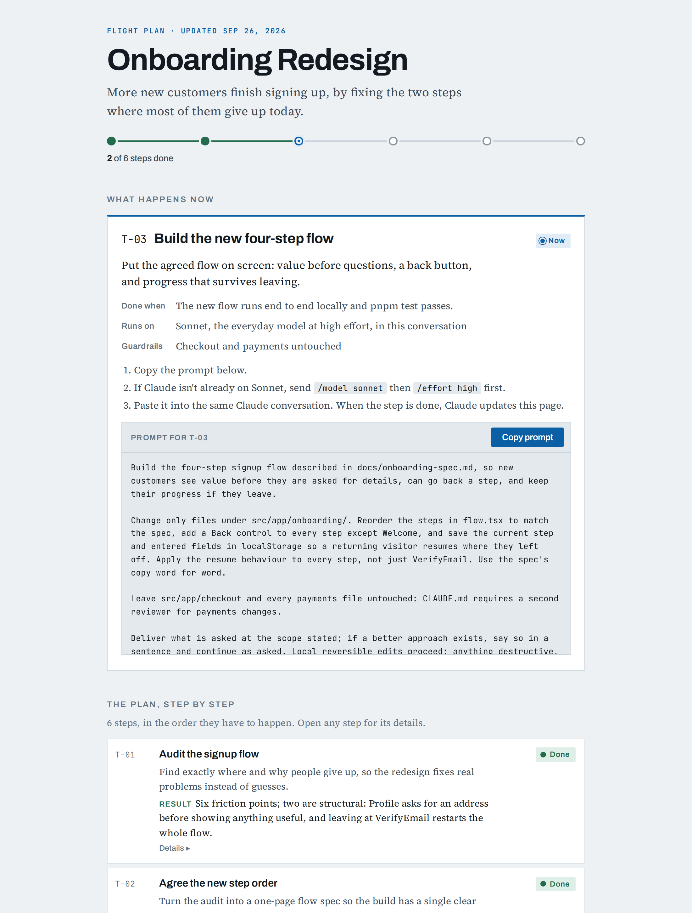

# flightplan

[](https://skills.sh/vignesh2699v/flightplan)

A skill for [Claude Code](https://claude.com/claude-code) that plans your work
before you start, then walks you through it one small step at a time.



## What it does

You tell it what you want to get done. It:

1. **Reads your project** so it doesn't ask you things it can find out itself.
2. **Asks a few questions** only if something is unclear. Often it asks none.
3. **Makes a plan page** you can open in your browser. It lists every step in
   order, says what each one is for, and shows what's done and what's next.
4. **Gives you one step at a time.** Each step comes as a ready-made prompt:
   copy it from the page and paste it into Claude. When the step is finished,
   Claude marks it done on the page and gives you the next one.

For each step it also picks the best tool you have installed and the right
Claude model for the job, and writes the prompt in the way that model works
best.

Small requests skip the plan: you get one ready-to-paste line instead.

Flightplan only plans. It never does the work itself; you stay in control of
every step.

## Install

In your terminal:

```bash
npx skills add vignesh2699v/flightplan -a claude-code
```

Add `-g` at the end to install it for all your projects. Then start a new
Claude Code session.

Prefer to install by hand?

```bash
git clone https://github.com/vignesh2699v/flightplan.git
cp -r flightplan/skills/flightplan ~/.claude/skills/
```

## Use it

Type `/flightplan` and describe what you want to do:

```
/flightplan redo the signup flow, too many people give up halfway
```

Come back later and type `/flightplan` again. It finds your plan and picks up
where you left off.

## Good to know

- Your plan pages are saved in `~/.claude/flightplan/` on your computer.
- The plan page is also published to your own claude.ai account so you can
  open it in a browser. It stays private until you share it.
- It works with whatever skills and tools you already have. Nothing else needs
  installing.

## More

- [How it was tested](eval/2026-09-26-v3.0-results.md)
- [Design notes](docs/design-notes.md) and [changelog](CHANGELOG.md)
- Checks for contributors: `python3 scripts/check-skill.py` and
  `python3 scripts/lint-duplication.py`

## License

MIT. See [LICENSE](LICENSE).
